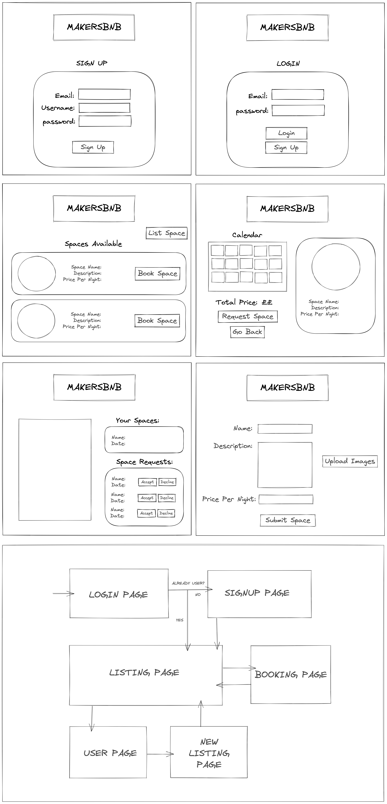
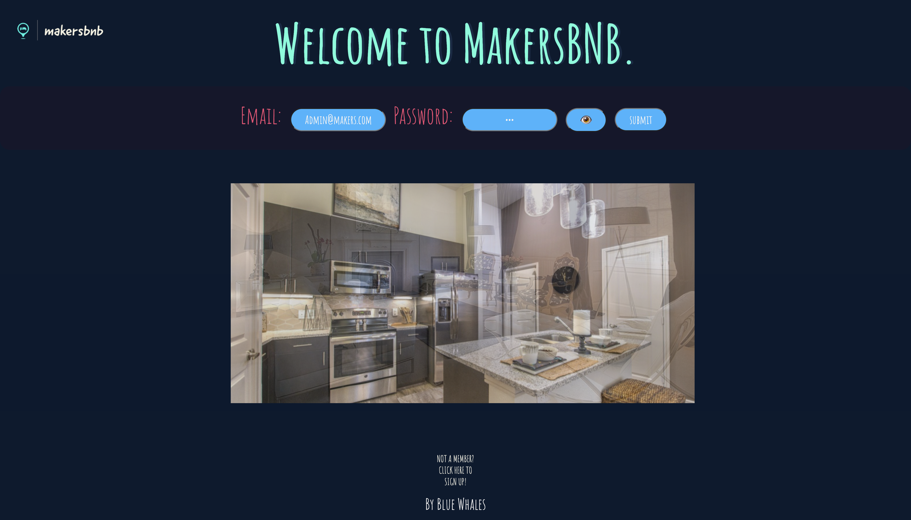
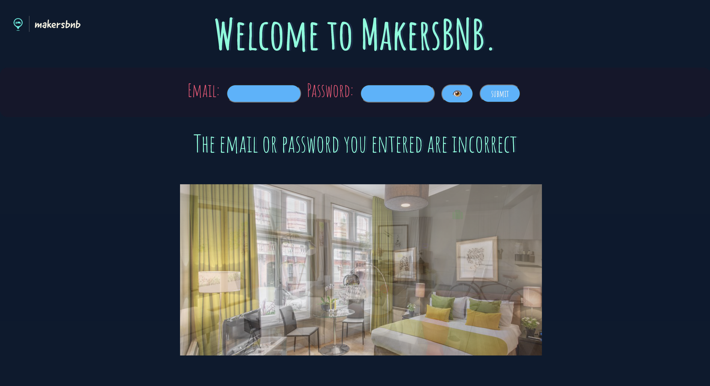
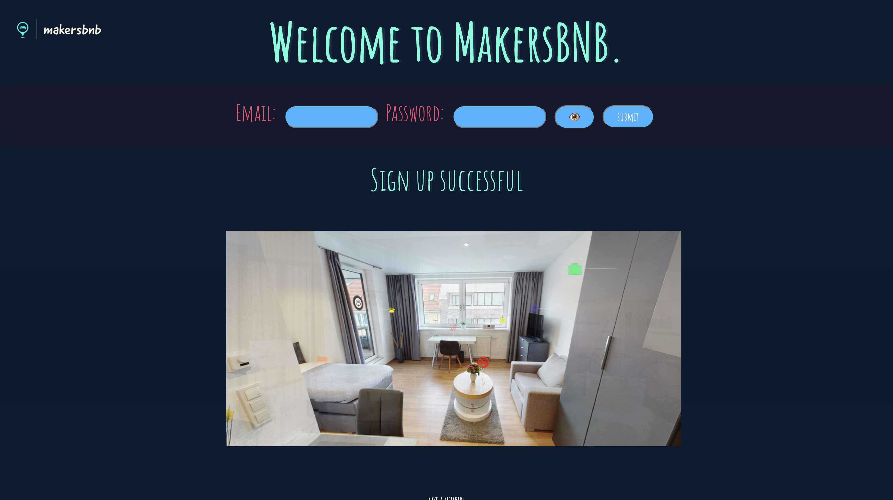
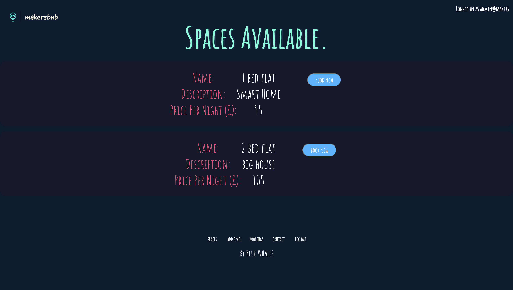
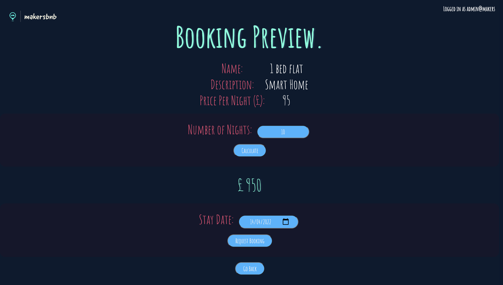
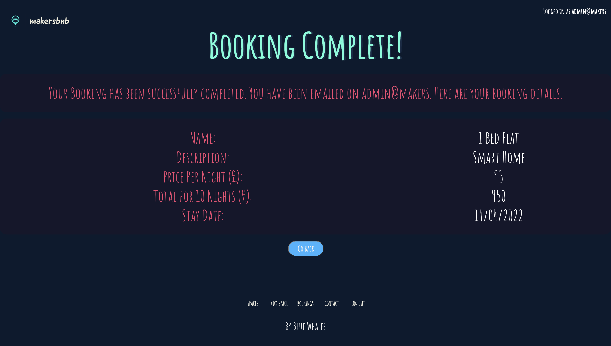

# MakersBNB
## Installing Locally

```ruby
$ git clone https://github.com/khadirkilo92/makersbnb.git
$ cd makersbnb
$ bundle install
$ rackup
```
## Run Web App

```ruby 
$ ruby app.rb
```
or

```ruby 
$ rackup config.ru
```

## Postgres Install

```ruby
$ brew install postgresql

$ brew services start postgresql

$ psql postgres
```
## Setup makersbnb and makersbnb_test Database

```sql
psql

CREATE DATABASE makersbnb;

\c makersbnb

CREATE TABLE spaces(id SERIAL PRIMARY KEY, name VARCHAR(40), description VARCHAR(240), price_per_night FLOAT4);

\q

CREATE DATABASE makersbnb_test;

\c makersbnb_test

CREATE TABLE spaces(id SERIAL PRIMARY KEY, name VARCHAR(40), description VARCHAR(240), price_per_night FLOAT4);

```

## MakersBNB Model



## MakersBNB Web Pages








## User Stories
```
As a user 
So that I can know the website
I want to see a logo and a welcome.

As a user 
So that I can login 
I want to enter my email and password. 

As a user 
So that I can signup 
I want to enter my email and password and submit it.

As a a user 
So that I can see all spaces
I want a listings page with all listings 

As a customer
So that I can compare details of different listings
I want to view the name, description, picture/price

As a user 
So that I can add a space
I want to go to add listings page.

As a user 
So that I can add my space 
I want to provide a description/picture/name/price

As a user 
So that I can create listing 
I want provide a description/form/name/price per night and then submit

As a a user
So that I can upload my pictures
I want a link to upload my pictures 

As a user 
So that I can book now
I want a book now button

As a customer
So that I can compare details of different listings
I want to view the name, description, picture/price

As a user 
So that I can see the dates available 
I want to view them on a calendar 


As a user 
So that I know how much it costs
I want to see a total sum for the nights selected 

As a user 
So that I can return to the previous
I want a return button

As a user 
So that I can confirm my booking 
I want a request booking button

As a user 
So that I can see all my current and previous bookings 
I want a list of my current bookings and previous bookings


As a user 
So that I can approve requests
I want to review requests

As a user
So that can respond to request 
I want to approve or decline a request.
```
