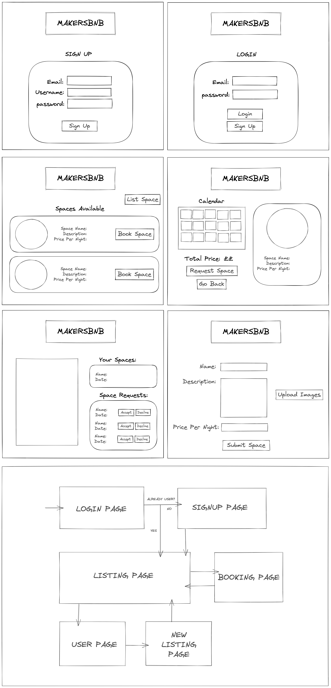
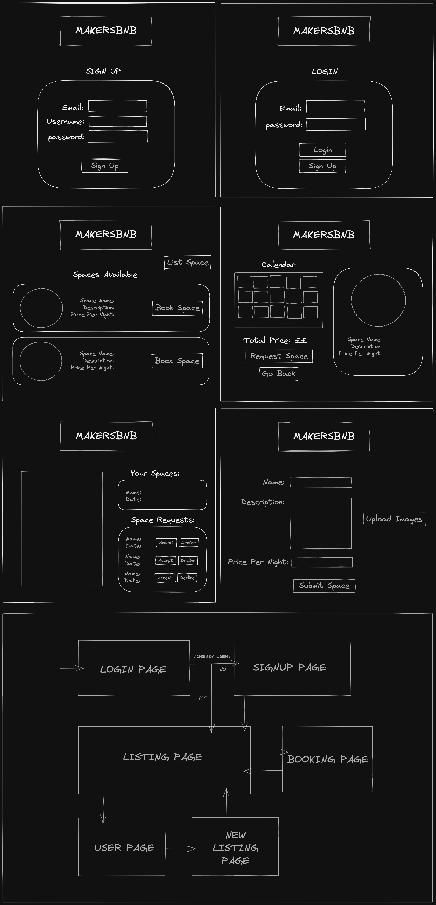

# makersbnb
## Installing locally

```ruby
$ git clone https://github.com/khadirkilo92/makersbnb.git
$ cd makersbnb
$ bundle install
$ rackup
```
## Run the app

```ruby 
$ ruby app.rb
```
or

```ruby 
$ rackup config.ru
```

## RPS Web Pages


